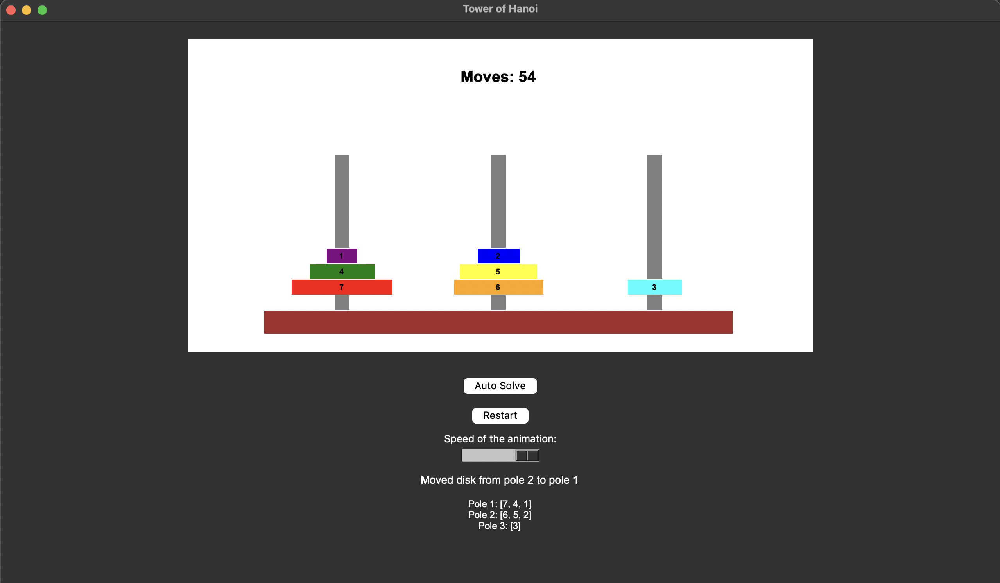

# Tower of Hanoi

A graphical implementation of the classic Tower of Hanoi puzzle game using Python and Tkinter.



## Description

Tower of Hanoi is a mathematical puzzle where the objective is to move a stack of disks from one rod to another, following these simple rules:
- Only one disk may be moved at a time.
- Each move consists of taking the upper disk from one stack and placing it on top of another stack.
- No disk may be placed on top of a smaller disk.

This implementation provides both manual play and an auto-solve feature using efficient algorithms.

## Features

- Interactive GUI built with Tkinter
- Customizable number of disks (1-7)
- Color-coded disks for better visibility
- Adjustable animation speed for auto-solve
- Move counter to track progress
- Two solving algorithms:
  - Recursive algorithm for initial state
  - BFS (Breadth-First Search) for any game state

## How to Play

1. Start the game by running `python Tower_of_Hanoi.py`
2. Enter the number of disks (1-7)
3. Click on poles to move disks:
   - First click: Select source pole
   - Second click: Select destination pole
4. Alternatively, use the "Auto Solve" button to watch the puzzle solve itself
5. Adjust the animation speed with the slider
6. Click "Restart" to begin a new game

## Project Structure

- **main.py (TowerOfHanoi class)**: The main game engine that handles the GUI, user interactions, and game logic
- **game_state.py (GameState class)**: Manages the state of the game including disk positions and valid moves
- **solving_algorithms.py (Solver class)**: Contains algorithms to solve the puzzle automatically

## Requirements

- Python 3.x
- Tkinter (usually included with Python installation)

## Installation

1. Clone this repository:
   ```
   git clone https://github.com/yourusername/tower-of-hanoi.git
   ```

2. Navigate to the project directory:
   ```
   cd tower-of-hanoi
   ```

3. Run the game:
   ```
   python main.py
   ```

## Implementation Details

The project implements two solving algorithms:
1. **Algorithm Solver**: Optimal solution for the standard initial state (all disks on the first pole)
2. **BFS Solver**: General solution that works for any valid game state

The minimum number of moves required to solve a Tower of Hanoi puzzle with n disks is 2^n - 1.

## Future Improvements

- Drag and drop functionality for moving disks
- High score tracking
- Additional visualization options
- Sound effects

## License

This project is open source and available under the [MIT License](LICENSE).
